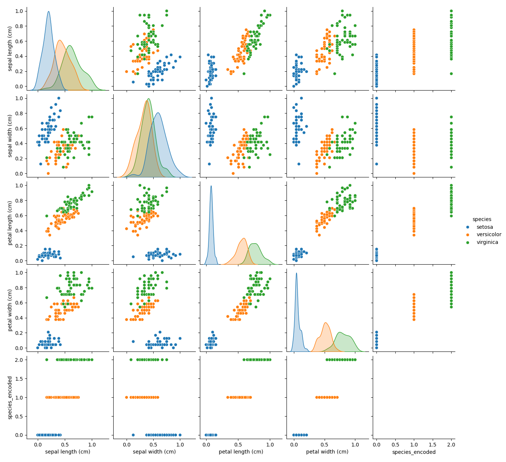
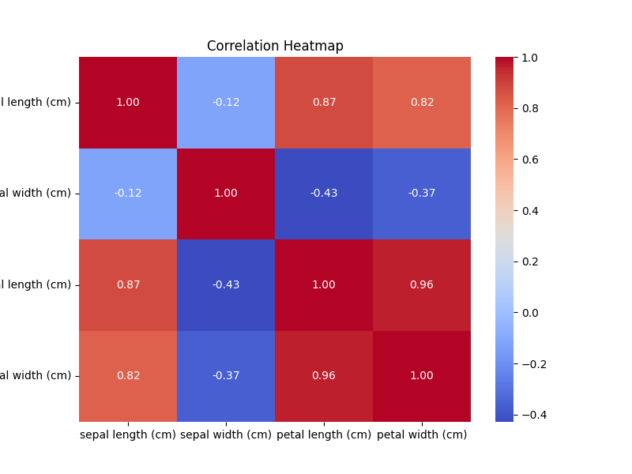
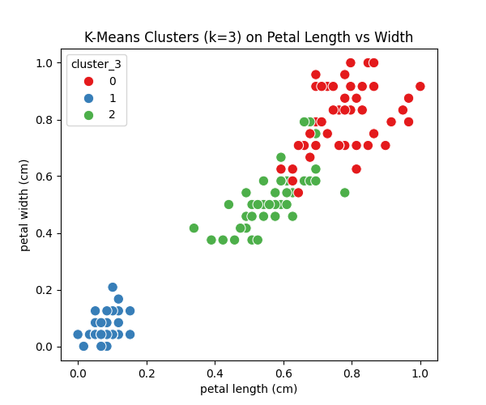
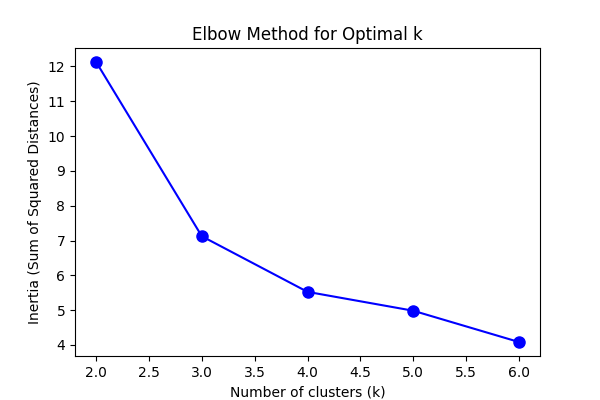

# Zakariya Shafi 596
# DSA-2040 Practical Exam Project  
 

This repository contains the complete solution for the **DSA-2040 Practical Exam**, covering **Data Warehousing** and **Data Mining**. It demonstrates designing a data warehouse, performing ETL, OLAP queries, and applying data mining techniques including preprocessing, clustering, classification, and association rule mining.

---

## Table of Contents
1. [Data Warehousing](#data-warehousing)  
2. [Data Mining](#data-mining)  
3. [Repository Files Overview](#repository-files-overview)  
4. [How to Run](#how-to-run)  

---

## Data Warehousing 

### Task 1: Data Warehouse Design 

**Scenario:**  
Design a data warehouse for a retail company tracking sales, customers, products, and time.

**Star Schema Design:**  
- **Fact Table:** `SalesFact`  
  - Measures: `TotalSales`, `Quantity`  
  - Foreign Keys: `CustomerID`, `ProductID`, `TimeID`  
- **Dimension Tables:**  
  1. `CustomerDim` – `CustomerID`, `Name`, `Country`  
  2. `ProductDim` – `ProductID`, `ProductName`, `Category`  
  3. `TimeDim` – `TimeID`, `Date`, `Month`, `Quarter`, `Year`  
  4. Optional: `CountryDim` – `CountryID`, `CountryName`  

**Schema Diagram:**  
  

**Why Star Schema?**  
The star schema is chosen because it simplifies queries, improves OLAP performance, and is easier to understand for business users. Denormalization reduces the number of joins required.

## Task 2: ETL Process Implementation 

**ETL Steps:**

- **Extract:** Load CSV or generate synthetic data, handle missing values, convert `InvoiceDate` to datetime  
- **Transform:** Calculate `TotalSales`, create customer summaries, filter last-year sales, remove outliers  
- **Load:** Insert data into SQLite database `retail_dw.db` (tables: `SalesFact`, `CustomerDim`, `TimeDim`)  
- Python ETL function logs rows processed at each stage  

**Files:**
- `etl_retail.py`  
- `retail_dw.db`  

---

## Task 3: OLAP Queries and Analysis 

- Roll-up, Drill-down, Slice queries using SQL  
- Visualization of results (bar chart of sales by country)  
- Analysis of insights and decision-making support  

**Visualization Example:**  
 

**Files:**
- `olap_queries.sql`  
- Analysis report in Markdown/PDF  

---

## Data Mining 

### Task 1: Data Preprocessing and Exploration 

**Dataset Options:**  
- Iris dataset from scikit-learn (`load_iris()`)  
- Or synthetic data: 150 samples, 3 clusters, Gaussian features  

**Steps:**
1. Load dataset using pandas or scikit-learn (or generate synthetic data)  
2. **Preprocess:**  
   - Handle missing values  
   - Normalize features with Min-Max scaling  
   - Encode class label if needed  
3. **Explore:**  
   - Compute summary statistics (`pandas.describe()`)  
   - Visualize pairplot and correlation heatmap  
   - Identify potential outliers via boxplots  
4. Split data into train/test sets (80/20)  

**Visualizations Example:**  
- Pairplot: 
- 
 
- Correlation Heatmap: 
- 
 

**File:**
- `preprocessing_iris.py`  

---

### Task 2: Clustering 

**Steps:**
- Apply K-Means (k=3) on features (exclude class), compare with true classes using Adjusted Rand Index (ARI)  
- Experiment: Try k=2 and k=4, plot elbow curve to justify k  
- Visualize clusters (scatter plots by features, colored by cluster)  
- Analyze cluster quality, misclassifications, and real-world applications  

**Visualizations Example:**  
- Cluster Scatter Plot: 
- 
  
- Elbow Curve: *Insert image here*
- 
  


**File:**
- `clustering_iris.py`  

---

### Task 3: Classification & Association Rule Mining 

**Part A: Classification**
- Train Decision Tree classifier, evaluate on test set (accuracy, precision, recall, F1-score)  
- Visualize tree (`plot_tree`)  
- Compare with another classifier (e.g., KNN) and report which performs better  

**Decision Tree Example:** 


**Part B: Association Rule Mining  
- Generate synthetic transactional data (20-50 transactions, baskets of 3-8 items)  
- Apply Apriori algorithm (`mlxtend`) with `min_support=0.2` and `min_confidence=0.5`  
- Display top 5 rules sorted by lift  
- Analyze one rule and its retail implications  
 

**Marks Allocation:**
- Classification implementation & metrics: 5  
- Comparison & visualization: 5  
- Apriori implementation: 5  
- Rule analysis: 5  

**File:**
- `mining_iris_basket.py`  

---

## Repository Files Overview

| File | Description |
|------|-------------|
| `etl_retail.py` | ETL process for retail data warehouse |
| `retail_dw.db` | SQLite database |
| `star_schema.png` | Star schema diagram |
| `olap_queries.sql` | OLAP queries |
| `sales_by_country.png` | Visualization of sales by country |
| `preprocessing_iris.py` | Iris data preprocessing |
| `clustering_iris.py` | K-Means clustering |
| `mining_iris_basket.py` | Classification & Association Rule Mining |
| `images/` | Folder containing all visualization images |
| `README.md` | Project documentation |

---

## How to Run

1. Install Python 3.x and required libraries:
```bash
pip install pandas numpy scikit-learn matplotlib seaborn mlxtend
